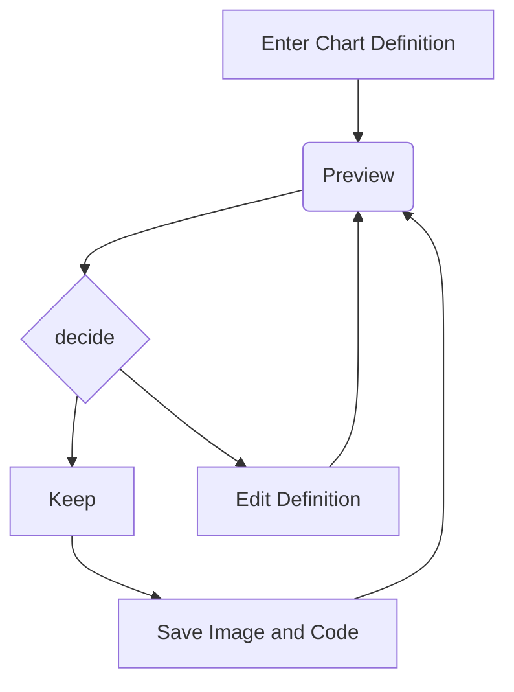

# 功能演示

## 点击图片放大


## 左右键切换文章

## 滚动定位 + 目录定位

## Mermaid语法支持

> 需要启用



## latex 语法支持

> 需要启用

## github markdown

```markdown
> [!NOTE]  
> Highlights information that users should take into account, even when skimming.

> [!TIP]
> Optional information to help a user be more successful.

> [!IMPORTANT]  
> Crucial information necessary for users to succeed.

> [!WARNING]  
> Critical content demanding immediate user attention due to potential risks.

> [!CAUTION]
> Negative potential consequences of an action.

> [!QUESTION]
> Negative potential consequences of an action.
```


> [!NOTE]  
> Highlights information that users should take into account, even when skimming.

> [!TIP]
> Optional information to help a user be more successful.

> [!IMPORTANT]  
> Crucial information necessary for users to succeed.

> [!WARNING]  
> Critical content demanding immediate user attention due to potential risks.

> [!CAUTION]
> Negative potential consequences of an action.

> [!QUESTION]
> 我想知道这个问题是否还存在
