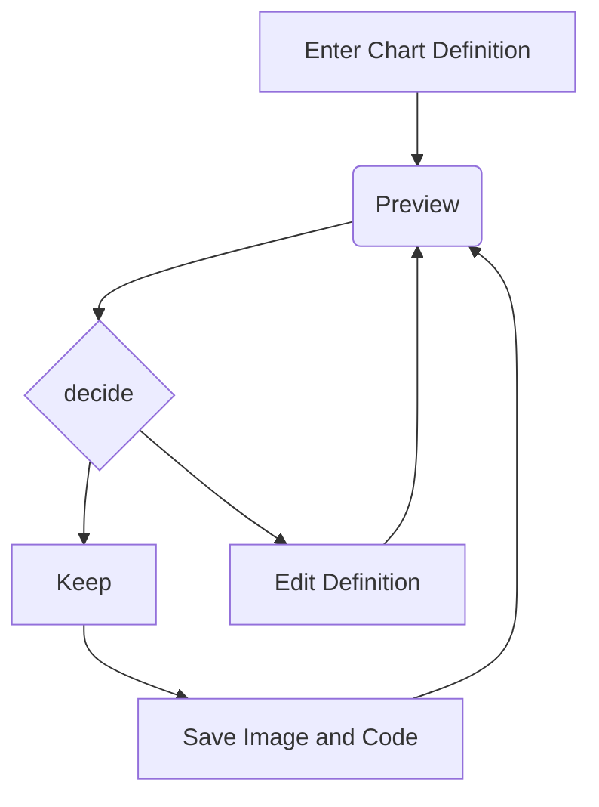

# 功能演示

## 点击图片放大


## 不同图片尺寸

```Markdown


# 结尾加上 `|mid` 表示中等尺寸


# 结尾加上 `|small` 表示小尺寸

```


## 左右键切换文章

## 滚动定位 + 目录定位

## Mermaid语法支持

> 需要启用



## 代码高亮

```c{5-7}
// 注释信息
#include <linux/init.h>
#include <linux/module.h>

static int major = 237;
static int minor = 0;
static dev_t devno;


static int hello_open (struct inode *inode, struct file *filep)
{
	printk("hello_open()\n");
	return 0;
}
static int hello_release (struct inode *inode, struct file *filep)
{
	printk("hello_release()\n");

	return 0;
}

#define KMAX_LEN 32
char kbuf[KMAX_LEN+1] = "kernel";
//write(fd,buff,40);
static ssize_t hello_write (struct file *filep, const char __user *buf, size_t size, loff_t *pos)
{
	int error;
	if(size > KMAX_LEN)
	{
		size = KMAX_LEN;
	}
	memset(kbuf,0,sizeof(kbuf));
	if(copy_from_user(kbuf, buf, size))
	{
		error = -EFAULT;
		return error;
	}
	printk("%s\n",kbuf);
	return size;
}
```

如果希望高亮某一行或者某一个 token, 标记语法为 

```markdown
# 高亮 5 - 7 行
# ```c{5-7}

# 高亮第 8 个 token
# ```c{#8}
```

如果不确定行号, 可以暂时标记为 {?}, 执行后会在终端中输出如下信息辅助定位, 如不确定 token id 可以标记为 {??}


## latex 语法支持

> 需要启用

## github markdown

```markdown
> [!NOTE]  
> Highlights information that users should take into account, even when skimming.

> [!TIP]
> Optional information to help a user be more successful.

> [!IMPORTANT]  
> Crucial information necessary for users to succeed.

> [!WARNING]  
> Critical content demanding immediate user attention due to potential risks.

> [!CAUTION]
> Negative potential consequences of an action.

> [!QUESTION]
> Negative potential consequences of an action.
```


> [!NOTE]  
> Highlights information that users should take into account, even when skimming.

> [!TIP]
> Optional information to help a user be more successful.

> [!IMPORTANT]  
> Crucial information necessary for users to succeed.

> [!WARNING]  
> Critical content demanding immediate user attention due to potential risks.

> [!CAUTION]
> Negative potential consequences of an action.

> [!QUESTION]
> 我想知道这个问题是否还存在
