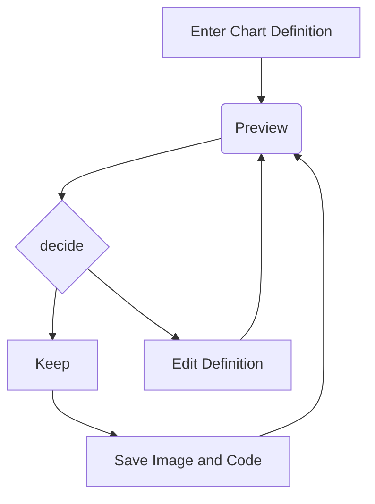

# 功能演示

## 点击图片放大

## 左右键切换文章

## 滚动定位 + 目录定位

## Mermaid语法支持

> 需要启用

```mermaid
graph TD
    A[Enter Chart Definition] --> B(Preview)
    B --> C{decide}
    C --> D[Keep]
    C --> E[Edit Definition]
    E --> B
    D --> F[Save Image and Code]
    F --> B
```

## latex 语法支持

> 需要启用